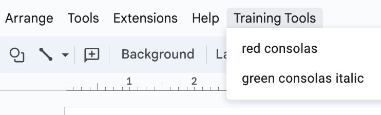

# Automating content development using Google Apps Script


## Overview

Content developers can use a web-based application called Google Slides to create presentations. If you are unfamiliar with Google Slides, it is similar in functionality to Microsoft PowerPoint.

Within Google Slides, you can automate a frequently repeated sequence of manual tasks for end users into a custom function that they run from the main menu.  Enabling content developers to run a custom function that automates a sequence of repetitive manual saves time and promotes content consistency.

frequently used, repetitive tasks.

by end users, and let the users run these functions 
Google Apps Script is a rapid development platform for extending functionality in Google Workspace applications such as Google Slides and Google Docs. If you are unfamiliar with Google Slides and Docs, they are similar in fuIctionality to Microsoft PowerPoint and Word.


With Apps Script, you can write custom functions that automate frequently used tasks by end users. And you can add custom menu items to Google Slides and Docs, so end users can run these functions from the main menu. Automating tasks, frequently used  by content developers, 


To do this, you will add functions and menu items to Google Slides that enable content developers to apply multiple, predetermined style changes to selected text in one step. 

This guide assumes only basic familiarity with Google Slides (similar to Microsoft PowerPoint) and an object-oriented programming language such as Javascript. 

To complete this lesson, all you need is a Gmail account.


## Getting Started

In Apps Script, you write scripts with access to built-in libraries and data objects comprising the structure and content of presentations and documents.
 
Below is an Apps Script function. Apps Scripts can be bound to a specific application. This function applies mutliple style changes to selected text in its bound presentation. Lines 5 and 6 get selected text. Lines 10 to 13 apply predetermined style changes. 


In this exercise, you will add functions bound to a Google Slides presentation and add custom menu items that trigger two predetermined style changes as[ shown below.



For more details, refer to Google Apps Script [documentation](https://developers.google.com/apps-script/overview).


## Create a Gmail account

Running scripts requires two-factor authentication disabled and access to personal data, so it will be safer and quicker to run these exercises from a temporary Gmail account.

Open a web browser and go to [gmail.com](https://gmail.google.com/) and create a Gmail account; it only takes about 60 seconds.

When you finish creating the account, Gmail opens and gives you access to other Google Workspace applications.

## Create a new presentation in Google Slides

In the main Gmail page, click the **Google apps** icon (top-right) where you can . This opens Google Workspace where you can create a new presentation.


In the dialog popup, select **Drive**.  Google Drive is where you can create Google Slides and Docs.

Click the **+ New** button (top-left) and select **Google Slides** to create a new presentation in Google Slides.

## Add some text to format

You need some text in slides to select, so you might as well add that now.

In the slide editor (center of page), click the title and subtitle text boxes and enter some text that you can format later.


## Add functions that format text

Next, you define functions that will apply style changes when users select text to change.

Click **Extensions** in the main menu and select **Apps Script** to open the script editor. 

> **NOTE:** If Extensions is not listed, widen the browser window until it shows.


Copy the code below and paste it in the main editor window so it replaces the default, empty function.

```
function setRedConsolas() {
   setColoredFont("#FF0000", "Consolas");
}

function setGreenConsolasItalic() {
   setColoredFont("#00b050", "Consolas", true);
}

function setColoredFont(color, font, italic=false) {
  var color, font, italic;
  
  // get text selection
  var selection = SlidesApp.getActivePresentation().getSelection();
  var text = selection.getTextRange();

  // format text
  if(text.getLength() > 0) {
    var style = text.getTextStyle();
    style.setForegroundColor(color);
    style.setFontFamily(font);
    style.setItalic(italic);
  }
}
```

Here is what a successful replacement looks like.


There are three functions: two functions (**setRedConsolas** and **setGreenConsolasItalic**) specify different style changes and call the third function (**setColoredFont**) to apply changes.

Click the **Save Project** icon to save your functions before running and testing.


## Test and authorize your functions

In the next section, you add custom menu items that expose these functions to end users. But first you want to test and authorize them to act on data.

Return to slides and select some text to highlight (a word or two is all you need).


Leave the text selected and return to script editor.

Select **setRedConsolas** from the function drop-down selector (if not selected).


Click **Run** to call **setRedConsolas**. This tests the function and requests the necessary privileges to access and modify text in presentations.


Click **Review permissions**.


Select your temporary account.


Click **Advanced**.


Click **Go to untitled project (unsafe)**. This is just a warning.


Click **Allow**.


You should see the following messages in the Execution log appear as shown below.

> **NOTE:** You may need to run the script a second time after authorizing it.


If you get an error like the one below, no text was selected. Reselect some text in slides and rerun the function.


Return to slides and notice the styles applied.

Select some other text and test **setGreenConsolasItalic**.

Congratulations! Your functions are working.


## Add functionality to the main menu

Now it's time to expose these functions to end users.

Copy and paste the following **onOpen** function into the top of the script editor.

```
function onOpen() {
  var ui = SlidesApp.getUi();
  
  ui.createMenu('Training Tools')
      .addItem('red consolas', 'setRedConsolas')
      .addItem('green consolas italic', 'setGreenConsolasItalic')
      .addToUi();
}
```

> **NOTE:** This function runs when a presentation containing it is opened for editing. It adds a menu item with two drop-down items. Each drop-down calls a function and applies style changes.

Save the changes to the script. 

Close and reopen the presentation.

> **NOTE:** You will be required to reauthorize the script so it can modify the main menu.

After the presentation opens, note the added menu item at the end of the main menu. 


> **NOTE:** If you do not see the added menu item, widen the browser window.

Select some text in the slide edit window and select one of the drop-down menu items.

Congratulations! You are now using custom functions to save time and promote consistency in your content.

## Doing more with Google Docs

If there was more time, you could learn how to customize Google Docs to insert custom quoted text boxes and code blocks like those found in Markdown.

Here is what a custom menu looks like in Google Docs with two functions that insert the preformatted text boxes shown (text is added by users after boxes are added).


