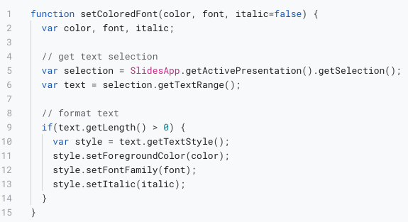
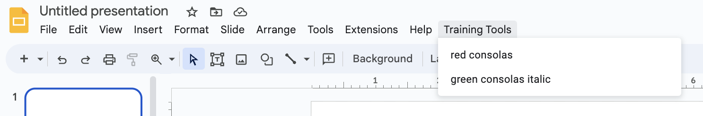
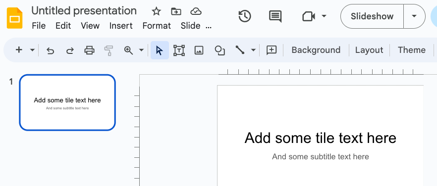
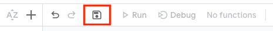
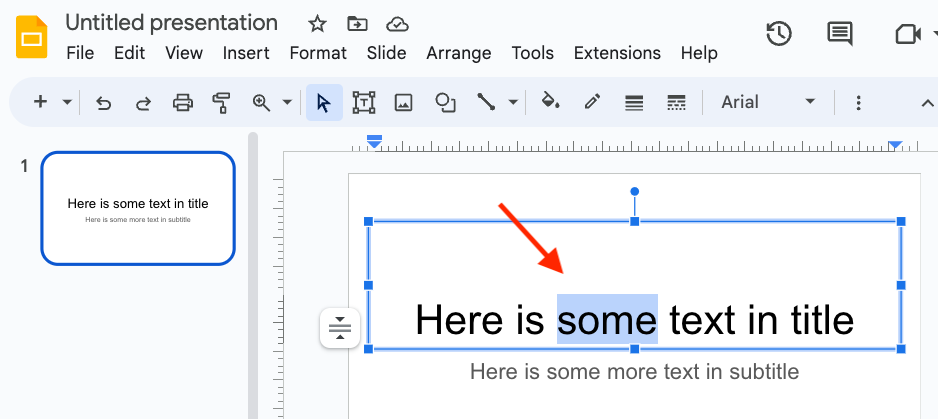
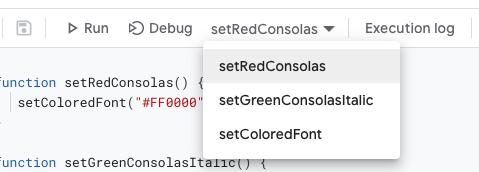
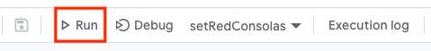
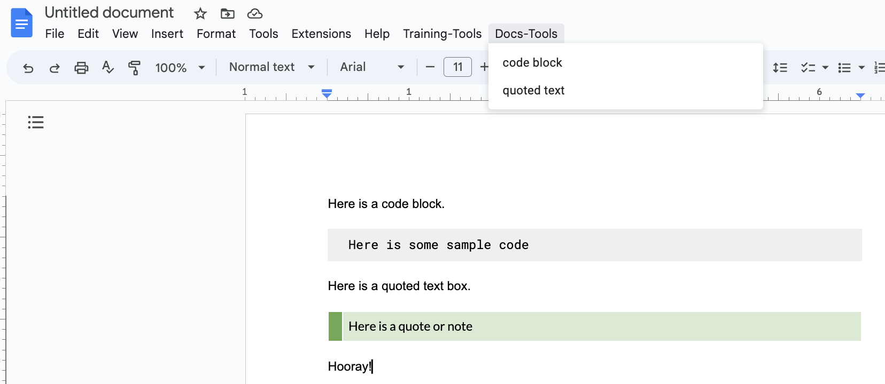

# Automating content development using Google Apps Script


## Overview

Content developers use applications such as Google Slides and Microsoft Powerpoint to create presentations. 

In Google Slides, there is a feature called Google Apps Script which enables you to write custom functions that perform manual editing tasks in code. Almost any manual action that you can perform in Google Slides can be automated.

In this tutorial, you will add functions and menu items that enable developers to apply multiple style changes to selected text in one step. Automating frequently used tasks such as these saves time and promotes consistency.

This guide assumes only basic familiarity with Google Slides and an object-oriented programming language such as Javascript. 


## What you will build

In this tutorial, you add the following function that applies multiple style changes to selected text in a presentation.

> Lines 5-6 get the selected text; lines 9-14 verify text was selected and apply style changes. 



You also add two wrapper functions that call this function with predetermined styles, and expose these functions to end users in the main menu as shown below.




## Create a Gmail account

To complete this lesson, you need a temporary Gmail account. 

> Google Slides comes with Gmail.  However, running scripts requires two-factor authentication disabled and access to personal data, so it is safer and faster to practice these steps in a temporary account.

Open a web browser.

Go to [gmail.com](https://gmail.google.com/) and create a Gmail account; it only takes about 60 seconds.

> When you finish creating the account, Gmail opens.


## Open a new presentation

In the main Gmail page, click the **Google apps** icon (top-right) to view other applications.


In the popup dialog, select **Drive**.

> Google Drive is where you create Google Slides.

Click the **+ New** button (top-left.)

Select **Google Slides** to open a new presentation.


## Add some text

You need some text in slides to select.

In the slide editor (center of page,) click the title and subtitle boxes and enter some text that you can format.




## Add functions that apply style changes

Next, you define functions that users run to apply style changes to selected text.

Click **Extensions** in the main menu and select **Apps Script** to open the script editor. 

> If **Extensions** is not listed, widen the browser window until it displays.

Copy the code below and paste it in the main editor window so it replaces the default function.

> There are three functions. **setRedConsolas** and **setGreenConsolasItalic** define style changes and call **setColoredFont** that applies changes.

```
function setRedConsolas() {
   setColoredFont("#FF0000", "Consolas");
}

function setGreenConsolasItalic() {
   setColoredFont("#00b050", "Consolas", true);
}

function setColoredFont(color, font, italic=false) {
  var color, font, italic;
  
  // get text selection
  var selection = SlidesApp.getActivePresentation().getSelection();
  var text = selection.getTextRange();

  // format text
  if(text.getLength() > 0) {
    var style = text.getTextStyle();
    style.setForegroundColor(color);
    style.setFontFamily(font);
    style.setItalic(italic);
  }
}
```

Click the **Save Project** icon to save your functions before running and testing them.




## Authorize functions to act on data

Before functions can apply style changes, you must authorize them to act on data.

Return to slides and select some text on which to apply style changes.

> A word or two is all you need.



Leave text selected and return to script editor.

Select **setRedConsolas** from the function drop-down selector (if not selected.)



Click **Run** to call **setRedConsolas**. 

> This requests permissions to modify text.



Navigate through the dialog to grant the permissions:
- Click **Review permissions**
- Select your temporary account
- Click **Advanced**
- Click **Go to untitled project (unsafe)**
- Click **Allow**.

You should see two messages without errors in the **Execution log**.

> You may need to run the script a second time after authorizing it.

If you get the following error, no text was selected. Reselect some text in slides and rerun the function.

```
TypeError: Cannot read properties of null (reading 'getLength')
```

Return to slides and observe the new style.

Select some other text and test **setGreenConsolasItalic**.

Congratulations! Your functions are working.


## Add functions to the main menu

Now it's time to expose these functions to end users.

Copy and paste the following **onOpen** function into the top of the script editor.

> This function runs when a presentation containing it is opened for editing. It adds a menu item with two drop-down items. Each drop-down item calls one of the wrapper functions that applies style changes.

```
function onOpen() {
  var ui = SlidesApp.getUi();
  
  ui.createMenu('Training Tools')
      .addItem('red consolas', 'setRedConsolas')
      .addItem('green consolas italic', 'setGreenConsolasItalic')
      .addToUi();
}
```

Save the changes to the script. 

Close and reopen the presentation.

> You will be required to reauthorize the script so it can modify the main menu.

After the presentation opens, note the added menu item at the end of the main menu. 

> If you do not see the added menu item, widen the browser window.


Select some text in the slide editor window as you did before, and select one of the drop-down menu items.

Congratulations! You are now using custom functions to save time and promote consistency in your content.


## Doing more with Google Docs

If there was more time, you could learn how to customize Google Docs (similar to Microsoft Word) with Google Apps Script.

Below is an example of two functions added to the main menu that enable users to insert quoted text boxes (green) and code blocks (gray) similar to those found in Markdown.

> Menu items insert preformatted empty boxes; users add text.




